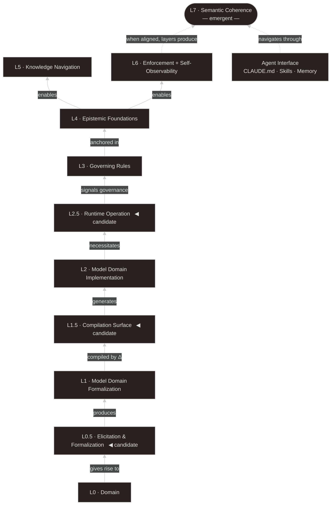

# Meta-Layers — System Design Framework

**Context:** This document describes the system-design framework that motivated the formal mathematical questions in DomainSpec. The compilation step (arrow Δ in the diagrams below) is formalized in the theorem catalog.

## Intro

Software is not just logic; it is a formalized representation of reality. Building it means codifying things that exist in the real world: rules, contracts, state changes, and flows. When these elements are unknown or poorly designed, systems silently drift. What follows is a framework to explicitly model that reality.

A domain gets represented first as an understanding—tacit in practitioners, formalized in specs. That understanding then gets encoded in software. Above those three sits a second track: the rules, foundations, and enforcement that keep the representations honest over time. Each layer has a distinct job.

Ten layers (seven original + three promoted candidates), two tracks. The bottom six are the object level: domain, elicitation, formalization, compilation surface, implementation, and runtime operation. The top four are the meta level: the rules, foundations, navigation, and enforcement that keep the object level coherent. L0.5, L1.5, and L2.5 are promoted candidates — admitted by the admission test in `proposed-new-layers.md`, validated by independent convergence in DomainSpec. Their empirical test: if none of them explains where drift originated in the next three failures, they get demoted.

## The Object Layer

The object layer is the concrete representation of the domain. It exists in three distinct levels.

The first layer is the domain (L0). This is the reality that precedes the software. The domain acts on the real world: entities acting within rules, relationships forming and dissolving, states changing. A customer requests a refund; an order is dispatched; a trust boundary is crossed. The system does not create this reality. It arrives late, and tries to keep up.

The second is the Model Domain Formalization (L1) — the understanding of that domain and it spans two distinct resolutions:

- **L1 operational (practitioners):** People who execute domain actions carry a local, situated, tacit understanding. The support agent knows they can manually approve a refund on day 31 if the customer is highly loyal. Their understanding is procedural, embedded in practice, and closest to L0.
- **L1 architectural (builders):** Builders seek a macro understanding. They see the domain as a set of entities relating through rules. The spec simply says "Refunds are blocked after 30 days." It is abstract, transferable, and distant from the lived reality of the domain.

The third is the Model Domain Implementation (L2) — the code, the schemas, the APIs - that makes the understanding executable. Software implements the domain model, not the domain directly. When it drifts from that understanding, the code becomes a silent source of bugs. If the operational reality allows a 31-day refund window for loyal customers, but the formal spec missed it, the software will hardcode a strict 30-day limit. The code will compile and execute perfectly, but the model it represents will be invalid.

This is how they relate:

```
L0 (Domain: entities · relations · rules)
      ↓ gives rise to
L1 (Model Domain Formalization: specs · ontology · DomainSpec)
      ↓ grounds
L2 (Model Domain Implementation: code · schema · APIs)
```

## The Meta Layer

The meta layer exists to ensure that the object track's formal model stays honest. It guarantees the system is built according to explicit rules, grounded in traceable premises, and enforced consistently enough that drift becomes visible before it becomes damage.

- **L3 — Governing Rules:** What should be built and how — at two densities. **L3-C (Constitutions):** prose rules with rationale and amendment history, for governance tasks. **L3-S (Skills):** operational extracts for execution tasks. Acts on the object track from outside it.
- **L4 — Epistemic Foundations:** The premises beneath L3's rules. Every convention has an assumption behind it. L4 makes those assumptions explicit. If the business decides loyalty no longer grants exceptions, the premise (L4) changes, which updates the rule (L3), which forces a change in the code (L2).
- **L5 — Knowledge Navigation:** Makes the accumulated knowledge across L1, L2, and L3 traversable for humans and agents. This is orientation, not enforcement.
- **L6 — Enforcement:** Turns L3's conventions into invariants. These are the pre-commit hooks, CI/CD gates, and extraction pipelines. Where L3 prescribes, L6 blocks. It is the only layer that actively prevents violations from landing.

When governance rules live inside the system they govern, they become invisible. This is why L3 cannot live inside L2. Software necessitates governance, but it cannot contain it.

**L7 — Semantic Coherence (emergent).** L7 is not a layer you build. It is the navigable surface that emerges when L0 through L6 are aligned — the property that makes the system self-describing. When every symbol in code points to a defined term, every rule traces to a premise, and every document has a position in a typed graph with confidence levels, the system can answer questions about itself. The CLAUDE.md, skills catalog, and memory system are the *interface* through which an operator accesses this emergent surface — not the surface itself.

## The Compilation Arrow: Where DomainSpec Begins

The critical arrow in the meta-layers model is **L1 → L1.5/L2**, labeled "compiled by Δ."

This arrow represents the act of translation: taking a formal understanding of a domain and encoding it into executable code. That translation always has **[residue](../GLOSSARY.md#residue)** — information that cannot be fully preserved.

DomainSpec formalizes this [residue](../GLOSSARY.md#residue) mathematically:

- **[Schema-level](../GLOSSARY.md#compilation-and-contract) [residue](../GLOSSARY.md#residue):** Do the artifact types (L2) express every domain concept (L1)? Is there a right adjoint $G : L_2 \to L_1$?
- **[Instance-level](../GLOSSARY.md#compilation-and-contract) [residue](../GLOSSARY.md#residue):** When you populate domain states, compile them to artifacts, and read them back, is the round-trip perfect? Is the unit of the Kan extension adjunction an isomorphism?

The key discovery: **these two [residues](../GLOSSARY.md#residue) are independent.** Schema discipline (injectivity + faithfulness) does not automatically buy instance fidelity. They must be audited separately.

## The Feedback Arrows

The construction flow moves upward. The interesting dynamic is what flows back down.

- **L2 → L1 (The most useful loop):** Implementation forces precision in a way specification cannot. When a developer writes the refund function and realizes the spec doesn't define what happens on leap years, that ambiguity is destroyed. That gap belongs in L1 before it gets resolved in L2. If the developer just guesses in the code, the resolution is local and invisible.
    
- **L2 → L0 (The one to watch carefully):** Software reconfigures the domain it models. It introduces new required formats, new approval flows, and new operational constraints that didn't exist before the system was built. When this increases efficiency, it is symbiosis. When it creates friction that practitioners quietly route around, it is parasitism. You usually only see the distinction retroactively.
    
- **L3 → L1, L2 (Lateral governance):** The meta-system governs the object system from the outside. This is structural, not incidental — it is the reason the tracks must be separate.
    
- **L25 → L0 (The workaround signal):** Runtime operation is where symbiosis becomes parasitism. Systematic workarounds in L2.5 are evidence that L0 has changed in ways L1 hasn't yet captured. This arrow didn't exist in the original model; it's the feedback loop L2.5 makes visible.

- **L6 → L1, L2, L2.5 (Active validation):** The only layer that blocks. Commits that violate L1, events that don't match the catalog, and runtime signals that exceed thresholds are rejected or escalated. Conventions become invariants.

## Layer Map

The diagram below shows the full stack — object layers (L0–L2.5), meta layers (L3–L6), and the emergent surface (L7) — with the direction of flow and the labeled relationships described in the sections above. Half-layers marked `◀ candidate` are promoted from `proposed-new-layers.md`. The Agent Interface node represents the `CLAUDE.md`, skills catalog, and memory system: the operational surface through which an agent navigates the emergent L7, not a layer in its own right.



Read it bottom-up: the domain (L0) generates the understanding (L1) that gets compiled into code (L2), whose runtime signals feed governance (L3). Governance is grounded in explicit premises (L4), which enable navigation (L5) and enforcement (L6). When those layers are aligned, L7 emerges — and the Agent Interface is what makes that emergent surface accessible. The dashed arrows mark relationships that are conditional or emergent rather than structural.

> **Note — omitted feedback loops.** This diagram shows only the upward construction flow. It does not capture the feedback and governance arrows described in The Feedback Arrows section: L2 revealing gaps back in L1, L2 reconfiguring L0 over time, L2.5 workarounds surfacing as domain drift signals in L0, L3 governing L1 and L2 laterally, and L6 actively validating L1, L2, and L2.5. Those loops are equally structural — they just make the diagram unreadable if included here.

## A System That Explains Itself

When L7 emerges — when the layers are aligned — the system acquires a property that goes beyond correctness: it becomes self-describing. You can ask it what a concept means, where it lives in code, what depends on it, what rules govern it, and what would break if you changed it. The knowledge doesn't live in someone's head or in a Slack thread that scrolls away. It lives in the system, and the system can answer questions about its own structure.

This is not documentation. Documentation describes a system from outside. A self-describing system carries its meaning *in* its structure — the dictionary entries, the code tags, the typed edges, the confidence levels, the semantic embeddings. The meaning is not written about the system; the meaning *is* the system, read at the right level of abstraction.

The consequence of emergence: drift in any layer corrupts the semantics without breaking the system visibly. A rule in L3 whose L4 premise has become false, a navigation graph in L5 that no longer reflects actual structure — these don't produce errors. They produce a system that means something different from what it was designed to mean. The mismatch only surfaces when someone acts on it.

## Open Questions

This framework defines the structural boundaries, but the mechanics of living inside them carry unsolved tensions. These are the active open questions regarding implementation:

**1. Reconciling the two L1s at the enforcement gate** The operational understanding (L1-practitioner) handles edge cases and lived reality, while the architectural understanding (L1-builder) handles formalized rules. If an operator needs to process a legitimate exception, but the L1-builder spec forbids it, what does L6 (Enforcement) do? We need a mechanism to accommodate operational reality without forcing developers to break CI/CD or write invisible bypasses.

**2. The ergonomics of the Meta Track** "Every convention has an assumption behind it" (L4) is structurally true, but historically, systems that require heavy metalinguistic documentation rot because developers don't have the time to update them. How do we design the tooling so that updating L3 and L4 feels like an integrated part of writing code, rather than a bureaucratic tax?

**3. Human vs. Agent legibility** As L7 (Agent Orchestration) matures, the meta layers (L3-L6) will inevitably be optimized for AI consumption. If the rules and boundaries become highly structured for agents, how do we ensure they remain legible and editable by the human engineers who have to debug them?

## Connections

- **DomainSpec Two-Layer Residue** — Formal mathematical framework. The "compiled by Δ" arrow formalized in category theory. The unit η of the adjunctions measure [residue](../GLOSSARY.md#residue) precisely.
- **[Fractal Functors](../GLOSSARY.md#fractal-functor)** — Lean formalization. The limiting case where both [residues](../GLOSSARY.md#residue) are zero: the translation preserves information perfectly at both schema and instance levels.