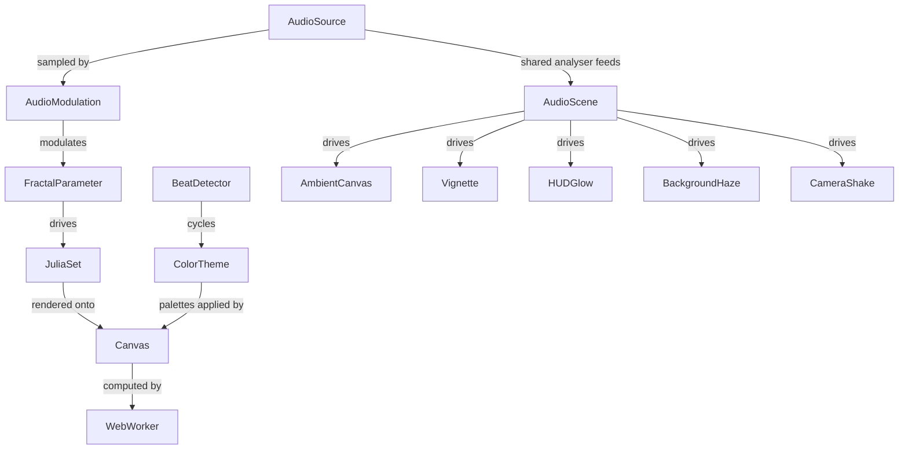

# fractal-ghibli-visualization

## What This Module Owns

An internal creative tool that renders interactive Julia Set fractals styled after Studio Ghibli color palettes. Owned entirely as a single self-contained HTML file — no backend, no auth, no external dependencies. Its purpose is visual exploration and developer delight inside the DomainSpec project. The fractal can be driven by direct slider input, by an autonomous sine-wave drift ("Variar função"), or by an audio file whose spectrum modulates the drift in real time.

## Module Map



## Capabilities

| Capability         | What                                      | Key Aspects                              | Detail                  |
| ------------------ | ----------------------------------------- | ---------------------------------------- | ----------------------- |
| FractalRendering   | Render Julia Set fractals interactively   | JuliaSet, FractalParameter, WebWorker    | Single-file, no deps    |
| ThemeSelection     | Apply Ghibli-inspired color themes        | ColorTheme                               | 5 themes, live switch   |
| ParameterControl   | Manipulate fractal shape in real time     | FractalParameter (Espírito, Profundidade, Essência) | Sliders + tooltips |
| FractalDive        | Continuous smooth free-fall into the fractal | DiveAnimation, RAF loop, CSS interpolation | Button + Space bar toggle |
| AudioReactivity    | Drive fractal parameters from an audio file's spectrum | AudioSource, FrequencyBand, AudioModulation, BeatDetector | 4 bands → 4 parameters; modulates the drift |
| AudioScene         | Drive peripheral on-screen elements from the same audio analyser | AmbientCanvas, Vignette, HUDGlow, BackgroundHaze, CameraShake, EdgeParticle, OnsetDetector | Quiet by default; master ambient knob; freezes during dive |
| PerformanceProbe   | Measure render and dive timing without changing default visuals | PerfOverlay, performance.now, RAF drop counter | Hidden by default; `?perf=1` or `P` |

### FractalRendering (inline)

Executes the Julia Set iteration formula z_{n+1} = z_n² + c on a Web Worker, paints pixel results to a Canvas 2D context.

| Aspect    | Concept           | Summary                                      |
| --------- | ----------------- | -------------------------------------------- |
| Operation | RenderFrame       | Runs iteration per pixel, posts ImageData    |
| Interface | WorkerMessage     | Postmessage contract between UI and worker   |
| State     | RenderingState    | idle / computing / complete                  |

### ThemeSelection (inline)

Maps a named Ghibli film to an OKLCH/RGB color ramp applied to iteration escape values.

| Aspect    | Concept     | Summary                              |
| --------- | ----------- | ------------------------------------ |
| Operation | ApplyTheme  | Replaces active color ramp, triggers re-render |
| Interface | ThemeMenu   | Radio/button group in self-explaining UI       |

### ParameterControl (inline)

Three named sliders drive the complex constant c and iteration depth.

| Aspect    | Concept          | Summary                               |
| --------- | ---------------- | ------------------------------------- |
| Operation | UpdateParameter  | Updates c or max_iter, triggers re-render |
| Interface | ParameterSlider  | Labeled slider with hover tooltip     |

### FractalDive (inline)

Continuous infinite zoom toward the view center. A `requestAnimationFrame` loop advances `view.zoom` by 1% per frame and applies a `CSS transform: scale()` to visually interpolate between renders, producing a smooth 60 fps falling sensation independent of worker speed. The worker renders at step=4 during the dive for throughput.

The dive does not stop at the F64 precision wall. Past `view.zoom ≥ PERT_ZOOM` (~10¹⁰) the renderer switches to a perturbation kernel: the main thread iterates a high-precision reference orbit at the view center using double-double arithmetic, and each worker iterates per-pixel deltas in F64 against that orbit. This pushes the visible precision wall from ~10¹³× to ~10³⁰×. As 1/zoom approaches the DD wall, `diveZoomFactor` is dampened toward 1 so the fall asymptotes smoothly instead of stopping or producing blocky pixels.

Activated by the "▼ Mergulhar" button or Space bar; stopped by the same controls, any drag, wheel, or touch.

| Aspect    | Concept          | Summary                                              |
| --------- | ---------------- | ---------------------------------------------------- |
| Operation | StartDive        | Begins RAF loop; zooms 1% per frame toward center    |
| Operation | StopDive         | Cancels RAF; fires full-quality re-render            |
| State     | DiveAnimation    | diving flag, diveZoomAtDraw, DIVE_SPEED constant     |
| Interface | DiveButton       | "▼ Mergulhar / ■ Parar" button with pulse animation |

### AudioReactivity (inline)

Splits an audio file's live FFT spectrum into four logarithmically-spaced bands and uses each band's smoothed energy to modulate one fractal parameter. The capability **does not replace** the existing `advanceParamTravel` sine-wave drift — instead, band energy scales the amplitude and phase rate of that drift. With no audio loaded, the fractal behaves exactly as before.

**Band → parameter map**

| Band      | Hz range    | Carries                  | Modulates              | Effect on existing drift                                                |
| --------- | ----------- | ------------------------ | ---------------------- | ----------------------------------------------------------------------- |
| SubBass   | 20–150 Hz   | kick drum, sub           | `diveSpeed` (Queda)    | Multiplies dive-zoom acceleration during a dive                         |
| Bass      | 150–500 Hz  | basslines, low body      | `radius` (Essência)    | Scales sine-wave amplitude around baseline 0.76                         |
| Mid       | 500–2000 Hz | vocals, lead melody      | `theta` (Espírito)     | Scales sine-wave amplitude around baseline 270° and the phase rate      |
| Treble    | 2–8 kHz     | hi-hats, cymbals, air    | `iterBase` (Profundidade) | Direct additive boost to iteration base                              |

**Modulation rule** (formal). Let `b ∈ {SubBass, Bass, Mid, Treble}`, `e_b ∈ [0,1]` be the EMA-smoothed normalized FFT mean over band `b`, and `s_b ∈ [0,1]` be the user-set sensitivity. Then per RAF tick:

```
theta    = 270 + (105 · s_Mid · e_Mid) · sin(φ · 0.71)
                + ( 42 · s_Mid · e_Mid) · sin(φ · 1.37 + 0.8)
radius   = 0.76 + (0.20 · s_Bass · e_Bass) · sin(φ · 0.43 + 1.4)
                + (0.09 · s_Bass · e_Bass) · sin(φ · 0.91)
iterBase = clamp(160 + 200 · s_Treble · e_Treble, 50, 600)
diveSpeedSlider = 1 + s_SubBass · e_SubBass     // visible at all times when audio drives
diveZoomMultiplier = diveSpeedSlider             // consumed by dive math only when diving
dφ/dt    = (0.18 + diveSpeed · 0.12) · (1 + 0.5 · s_Mid · e_Mid)
```

The SubBass→`diveSpeed` modulation is reflected in the slider value continuously while audio drives parameters; the multiplier only affects the *zoom rate* during an active dive. Slider values update at the audio analyser tick rate (~60 Hz). `scheduleRender()` is called at most once per 100 ms (10 Hz cap) to absorb deep-zoom render cost without backpressuring the worker pool.

The audio modulation loop owns its own drift: the existing `advanceParamTravel` (gated by `diving && paramTravelEnabled`) is left untouched, and audio adds its own drift contribution on top, so audio reactivity works whether or not a dive is active.

**Beat detection.** A rolling 2-second window of SubBass+Bass aggregate energy is maintained. A beat fires when current bass energy exceeds 1.4× the rolling average **and** at least 250 ms has elapsed since the last beat. The first beat in a session has no predecessor, so the 250 ms minimum interval does not apply to it (cold-start exception). Each beat advances `ColorTheme` to the next palette in fixed rotation order: Totoro → SpiritedAway → Mononoke → Howl → Nausicaä → Totoro.

**Lifecycle.** A user gesture (file picker click) creates the `AudioContext`. Loading a file connects `MediaElementAudioSourceNode → AnalyserNode → destination`. Stopping releases the context. The four `BandSensitivity` values persist via `localStorage`; the audio file itself does not.

| Aspect    | Concept                | Summary                                                                |
| --------- | ---------------------- | ---------------------------------------------------------------------- |
| Operation | LoadAudioSource        | User picks file; build Web Audio graph; transition state to `loaded`   |
| Operation | StartAudioModulation   | Begin per-frame band sampling + slider modulation; throttle re-renders |
| Operation | StopAudioModulation    | Tear down audio graph; revert sliders to user-controlled values        |
| Operation | SampleBandEnergies     | Per-tick FFT read → 4-band aggregate → EMA smoothing                   |
| Operation | ModulateParameters     | Apply modulation rule to slider values; `syncParamLabels()`            |
| Operation | DetectBeat             | Compare current bass energy to rolling average; emit BeatDetected      |
| State     | AudioReactivityState   | idle → loaded → playing ⇄ paused → idle                                |
| Event     | BeatDetected           | Triggers ColorTheme cycle                                              |
| Interface | AudioFilePicker        | `<input type="file" accept="audio/*">` + `<audio controls>`            |
| Interface | SensitivityPanel       | 4 sliders (one per band), 0–100%, persisted via `localStorage`         |

### AudioScene (inline)

Drives a small system of peripheral on-screen elements from the *same* audio analyser that powers AudioReactivity, so the user feels more of the song without overloading the central fractal. The fractal stays the focal element; AudioScene contributes ambient motion at the edges (vignette, edge particles, background haze) and texture (HUD glow, micro camera shake). Everything is gated by a master "ambient intensity" knob, palette-aware, quiet by default, and shares the existing `AnalyserNode` — there is still only one `AudioContext` per session.

**Element → signal map (v1)**

| Element              | Signal                  | Effect                                                                       |
| -------------------- | ----------------------- | ---------------------------------------------------------------------------- |
| HUDGlow              | Treble band (existing)  | Top-right HUD readouts shimmer/glow via CSS filter                           |
| Vignette             | Bass band (existing)    | Radial vignette overlay darkens on bass hits, lifts on rests                 |
| CameraShake          | BeatDetected (existing) | ≤ 2 px translate jitter on the canvas wrapper, decays over ~120 ms           |
| BackgroundHaze       | RMSEnergy (NEW)         | Soft palette wash behind canvas pulses opacity with overall energy           |
| EdgeParticle layer   | OnsetEvent (NEW)        | Each onset spawns short-lived palette-themed particles from screen edges     |

**New signals.** Two cheap signals are added to the existing analyser:

- **RMSEnergy** — `r ∈ [0,1]`. Computed per audio analyser tick from time-domain data (`analyser.getFloatTimeDomainData`): `r = clamp(sqrt(mean(x[i]²)) · GAIN, 0, 1)` with EMA smoothing α=0.20 over a 20 ms window. Captures perceived loudness envelope. `GAIN` is a fixed scalar (~3.0) chosen so typical music sits near the middle of the range.
- **OnsetEvent** — discrete event. Computed by spectral flux: `flux = Σ max(0, |X[k]| - |X_prev[k]|)` over the FFT magnitudes. Emits when `flux > 1.5 · rolling1sMean(flux)` AND `≥ 80 ms` since the last onset. Carries `strength = (flux / rollingMean) - 1`, clamped to `[0, 1]`. Independent from `BeatDetected` — onsets fire on hi-hats and snares too, beats fire on sustained low-frequency punch.

**Modulation rule** (formal). Let:

- `A ∈ [0,1]` = master ambient intensity (user-controlled; persisted under `fractal.audio.ambient`; default 0.6).
- `e_b ∈ [0,1]` = EMA-smoothed normalized FFT band energy (same definition as AudioReactivity).
- `r ∈ [0,1]` = EMA-smoothed RMS energy.
- `B(t)` = beat impulse: `1` at the moment `BeatDetected` fires, decaying as `exp(-t / 120ms)`.
- `O(t)` = onset event with `strength ∈ [0,1]`.

Per ambient frame (≤ 30 Hz, decoupled from the worker render schedule):

```
vignette.opacity     = 0.40 · A · e_Bass
hud.glow_opacity     = 0.60 · A · e_Treble
hud.glow_radius_px   = 4    · A · e_Treble
shake.amplitude_px   = 2    · A · B(t)        (mobile: 0)
haze.opacity         = 0.30 · A · r
particle.spawn_count = round(8 · A · O.strength)   on each OnsetEvent
```

`A = 0` collapses every ambient element to its idle baseline (opacity 0, zero shake amplitude, no spawns); the page renders as if AudioScene did not exist.

**Per-palette ambient table** (data-driven — single source of truth, no per-theme code paths):

| ColorTheme   | Particle visual    | Direction      | Spawn driver        |
| ------------ | ------------------ | -------------- | ------------------- |
| Totoro       | soot sprite        | drift up       | onset               |
| SpiritedAway | lantern-light haze | static behind  | rms                 |
| Mononoke     | forest spore       | spiral outward | onset density       |
| Howl         | falling ash        | diagonal       | treble              |
| Nausicaä     | wind streak        | top edge       | onset on high-mids  |

The Mononoke `onset density` driver counts onsets in a rolling 1 s window and maps `count / 8` to spawn rate; this is a v1 stand-in for the deferred tempo signal.

**Lifecycle.** AudioScene activates the first frame after AudioReactivity transitions to `playing`. It does **not** own its own AudioContext — it shares the AnalyserNode created by AudioReactivity. When AudioReactivity transitions to `idle` (audio stopped, picker closed, page hidden), all ambient elements fade to their idle baseline within one animation frame. While a fractal dive is active (`DiveAnimation.diving === true`), ambient elements freeze or fade out within ~200 ms — nothing competes with the dive.

**Mobile.** Particle count is capped at 24 on viewports narrower than 768 px (vs. 64 on desktop). `CameraShake.amplitude_px = 0` on mobile (felt as random jitter, not heard as music).

**Telemetry.** AudioScene contributes two new fields to the existing per-session aggregate `audio_session_summary` emitted at session end: `rms_avg` (mean of `r` over the session) and `onset_count` (integer count of `OnsetEvent` fires). No per-frame samples, no audio data, no song identification leave the page — same privacy posture as the existing per-band averages.

| Aspect    | Concept                | Summary                                                                       |
| --------- | ---------------------- | ----------------------------------------------------------------------------- |
| Operation | SampleAmbientSignals   | Per analyser tick: time-domain → RMS, FFT delta → spectral flux               |
| Operation | DetectOnset            | Spectral-flux threshold detector; fires `OnsetDetected` with strength         |
| Operation | RenderAmbientFrame     | Per-RAF tick: apply vignette, haze, HUD glow, shake; step particles            |
| Operation | SpawnEdgeParticles     | On `OnsetDetected`: spawn N particles per palette table, pooled allocation     |
| Operation | FadeAmbientToIdle      | One-frame fade-out triggered by audio stop or fractal dive                     |
| State     | AudioSceneState        | idle → active → frozen-during-dive ⇄ active → idle                             |
| Event     | OnsetDetected          | Carries `strength ∈ [0,1]`; consumed by particle spawn; counted in telemetry  |
| Interface | AmbientCanvas          | Second `<canvas>` overlay above the fractal canvas; particle layer            |
| Interface | AmbientIntensitySlider | One slider in SensitivityPanel; persisted under `fractal.audio.ambient`        |

### PerformanceProbe (inline)

Optional instrumentation mode for optimization work. It is hidden by default to keep the normal visual output unchanged. When enabled with `?perf=1` or the `P` key, it displays worker count, latest preview render time, latest full render time, main-thread commit time, and frame drops detected during the last 5 seconds of dive animation.

| Aspect    | Concept          | Summary                                              |
| --------- | ---------------- | ---------------------------------------------------- |
| Operation | MeasureRender    | Uses `performance.now()` around worker batch dispatch and final commit |
| Operation | MeasureDiveRAF   | Counts RAF deltas above 25ms in a rolling 5s window |
| Interface | PerfOverlay      | Hidden diagnostics panel toggled by query param or key |

## Domain Concepts

| Concept          | Type   | Key Constraints                                           |
| ---------------- | ------ | --------------------------------------------------------- |
| JuliaSet         | Entity | c = r·e^(iθ); z_{n+1} = z_n² + c; bounded escape test   |
| FractalParameter | Type   | Espírito ∈ [0,360°], Profundidade ∈ [50,400], Essência ∈ [0.0,1.5] |
| ColorTheme       | Enum   | Totoro, SpiritedAway, Mononoke, Howl, Nausicaa            |
| Canvas           | Entity | Single HTML5 Canvas element; painted via ImageData from worker |
| DiveAnimation    | Entity | RAF loop; DIVE_SPEED=1.010/frame; CSS scale interpolation; auto-stops at float precision limit |
| AudioSource      | Entity | One per session; created on user gesture; owns AudioContext + MediaElementSource + AnalyserNode; released on Stop |
| FrequencyBand    | Enum   | SubBass (20–150 Hz), Bass (150–500 Hz), Mid (500–2000 Hz), Treble (2–8 kHz) |
| BandEnergy       | Type   | Per band per tick; ∈ [0,1]; EMA smoothed with α=0.15 over normalized FFT bin mean |
| BandSensitivity  | Type   | Per band; ∈ [0,1]; user-controlled gain; persisted in `localStorage` under `fractal.audio.sensitivity` |
| AudioModulation  | Entity | Modulator that maps (BandEnergy × BandSensitivity) onto drift coefficients of `advanceParamTravel`; never replaces it |
| BeatDetector     | Entity | 2-second rolling-average detector on SubBass+Bass; threshold 1.4×; min interval 250 ms; emits BeatDetected |
| RMSEnergy        | Type   | r ∈ [0,1]; sqrt-mean-square over time-domain analyser data; EMA α=0.20 over 20 ms window |
| OnsetDetector    | Entity | Spectral-flux threshold detector; threshold 1.5×; min interval 80 ms; emits OnsetDetected with strength ∈ [0,1] |
| AmbientIntensity | Type   | A ∈ [0,1]; user-controlled master gain for all ambient elements; persisted in `localStorage` under `fractal.audio.ambient`; default 0.6 |
| AmbientCanvas    | Entity | Second HTML5 Canvas overlay layered above the fractal canvas; pooled particles; ≤ 40% effective opacity |
| Vignette         | Entity | DOM radial-gradient overlay; opacity bound to bass band × ambient intensity |
| HUDGlow          | Entity | CSS filter (drop-shadow + blur) on existing HUD readouts; bound to treble band × ambient intensity |
| BackgroundHaze   | Entity | DOM gradient layer behind the fractal canvas; opacity bound to RMS × ambient intensity |
| CameraShake     | Entity | Transform-translate jitter on the canvas wrapper; impulse-decay envelope from BeatDetected; disabled on mobile |
| EdgeParticle     | Entity | Pooled palette-themed particle (soot/lantern/spore/ash/wind streak); cap 64 desktop, 24 mobile; spawned on OnsetDetected per palette table |
| AudioSceneState  | Enum   | idle → active → frozen-during-dive ⇄ active → idle |
| PerfOverlay      | Entity | Hidden diagnostics overlay; must not alter canvas pixels or default HUD |

## Concept Registry

| Concept          | ID                                             | Type      |
| ---------------- | ---------------------------------------------- | --------- |
| JuliaSet         | fractal-ghibli-visualization.JuliaSet         | Entity    |
| FractalParameter | fractal-ghibli-visualization.FractalParameter | Type      |
| ColorTheme       | fractal-ghibli-visualization.ColorTheme       | Enum      |
| Canvas           | fractal-ghibli-visualization.Canvas           | Entity    |
| DiveAnimation    | fractal-ghibli-visualization.DiveAnimation   | Entity    |
| RenderFrame      | fractal-ghibli-visualization.RenderFrame      | Operation |
| ApplyTheme       | fractal-ghibli-visualization.ApplyTheme       | Operation |
| UpdateParameter  | fractal-ghibli-visualization.UpdateParameter  | Operation |
| StartDive        | fractal-ghibli-visualization.StartDive        | Operation |
| StopDive         | fractal-ghibli-visualization.StopDive         | Operation |
| MeasureRender    | fractal-ghibli-visualization.MeasureRender    | Operation |
| MeasureDiveRAF   | fractal-ghibli-visualization.MeasureDiveRAF   | Operation |
| PerfOverlay      | fractal-ghibli-visualization.PerfOverlay      | Entity    |
| AudioSource          | fractal-ghibli-visualization.AudioSource          | Entity    |
| FrequencyBand        | fractal-ghibli-visualization.FrequencyBand        | Enum      |
| BandEnergy           | fractal-ghibli-visualization.BandEnergy           | Type      |
| BandSensitivity      | fractal-ghibli-visualization.BandSensitivity      | Type      |
| AudioModulation      | fractal-ghibli-visualization.AudioModulation      | Entity    |
| BeatDetector         | fractal-ghibli-visualization.BeatDetector         | Entity    |
| LoadAudioSource      | fractal-ghibli-visualization.LoadAudioSource      | Operation |
| StartAudioModulation | fractal-ghibli-visualization.StartAudioModulation | Operation |
| StopAudioModulation  | fractal-ghibli-visualization.StopAudioModulation  | Operation |
| SampleBandEnergies   | fractal-ghibli-visualization.SampleBandEnergies   | Operation |
| ModulateParameters   | fractal-ghibli-visualization.ModulateParameters   | Operation |
| DetectBeat           | fractal-ghibli-visualization.DetectBeat           | Operation |
| BeatDetected         | fractal-ghibli-visualization.BeatDetected         | Event     |
| AudioReactivityState | fractal-ghibli-visualization.AudioReactivityState | State     |
| AudioFilePicker      | fractal-ghibli-visualization.AudioFilePicker      | Interface |
| SensitivityPanel     | fractal-ghibli-visualization.SensitivityPanel     | Interface |
| RMSEnergy            | fractal-ghibli-visualization.RMSEnergy            | Type      |
| OnsetDetector        | fractal-ghibli-visualization.OnsetDetector        | Entity    |
| OnsetDetected        | fractal-ghibli-visualization.OnsetDetected        | Event     |
| AmbientIntensity     | fractal-ghibli-visualization.AmbientIntensity     | Type      |
| AmbientCanvas        | fractal-ghibli-visualization.AmbientCanvas        | Interface |
| AmbientIntensitySlider | fractal-ghibli-visualization.AmbientIntensitySlider | Interface |
| Vignette             | fractal-ghibli-visualization.Vignette             | Entity    |
| HUDGlow              | fractal-ghibli-visualization.HUDGlow              | Entity    |
| BackgroundHaze       | fractal-ghibli-visualization.BackgroundHaze       | Entity    |
| CameraShake          | fractal-ghibli-visualization.CameraShake          | Entity    |
| EdgeParticle         | fractal-ghibli-visualization.EdgeParticle         | Entity    |
| AudioSceneState      | fractal-ghibli-visualization.AudioSceneState      | State     |
| SampleAmbientSignals | fractal-ghibli-visualization.SampleAmbientSignals | Operation |
| DetectOnset          | fractal-ghibli-visualization.DetectOnset          | Operation |
| RenderAmbientFrame   | fractal-ghibli-visualization.RenderAmbientFrame   | Operation |
| SpawnEdgeParticles   | fractal-ghibli-visualization.SpawnEdgeParticles   | Operation |
| FadeAmbientToIdle    | fractal-ghibli-visualization.FadeAmbientToIdle    | Operation |

## Acceptance Criteria

1. HTML file opens in browser with no network requests and no console errors.
2. Canvas renders a visible Julia Set fractal on initial load.
3. Moving any of the three parameter sliders (Espírito, Profundidade, Essência) updates the fractal without page reload.
4. Each of the five color themes (Totoro, Spirited Away, Mononoke, Howl, Nausicaä) produces a visually distinct palette.
5. Rendering is performed off the main thread via a Web Worker — UI controls remain responsive during computation.
6. All sliders and theme controls display descriptive tooltips on hover.
7. The UI is self-explaining: parameter names, ranges, and current values are always visible.
8. The file is entirely self-contained — no external scripts, stylesheets, or font requests.
9. The "▼ Mergulhar" button (or Space bar) starts a continuous, smooth infinite zoom into the fractal center.
10. The dive zoom animation runs at 60 fps via `requestAnimationFrame` with CSS scale interpolation between worker renders — no stutter.
11. The dive does not stop at the float64 precision wall. The advisory `#prec` warning appears when `1/view.zoom < 1e-13`, but the renderer transitions to a perturbation kernel and the dive continues with crisp imagery up to ~10³⁰×, then asymptotes smoothly via dampened `diveZoomFactor`.
12. Any drag, scroll, touch, or pressing the button again stops the dive cleanly and fires a full-quality re-render.
13. Performance diagnostics are opt-in only: `?perf=1` or `P` shows the overlay; default load keeps the overlay hidden.
14. Performance diagnostics must not change the fractal canvas pixels or the default interaction path.
15. With no audio loaded, the fractal renders, drifts (if "Variar função" is on), and dives exactly as before — AudioReactivity is fully opt-in.
16. Loading any common audio file (mp3, wav, ogg, m4a) via the file picker plays the song through the page audio output and starts modulating fractal parameters within ~200 ms of playback start.
17. Each of the four parameters (`diveSpeed`, `radius`, `theta`, `iterBase`) demonstrably reacts to its assigned band when that band's sensitivity is above zero, and stops reacting when sensitivity is at zero.
18. During silence (audio paused or near-zero band energy), the fractal continues its baseline drift — modulation never freezes the fractal.
19. Bass-spike beats advance `ColorTheme` to the next palette in fixed rotation order, with no theme cycle firing more than once per 250 ms regardless of input intensity.
20. The four `BandSensitivity` values persist across page reloads via `localStorage`; the loaded audio file does not persist (object URLs are recreated on each load).
21. Audio-driven re-renders are throttled to at most 10 Hz; render queue does not grow unbounded under continuous audio playback at any zoom level.
22. Stopping audio modulation (closing the picker, ending playback, page hide) releases the `AudioContext` and reverts sliders to user-controlled values within one frame.
23. Audio telemetry, when enabled, emits only per-session aggregate band averages — no per-frame samples, no audio data, and no song identification leave the page.
24. Existing slider drag, dive, theme switching, and reset all continue to work while audio is loaded and playing.
25. With no audio loaded, no AudioScene element renders: vignette and haze opacity are 0, no particles exist on the ambient canvas, and the canvas wrapper has no shake transform — AudioScene is fully opt-in.
26. With audio loaded and master `AmbientIntensity > 0`, vignette opacity tracks bass, HUD readouts glow on treble, the canvas micro-shakes on `BeatDetected`, background haze opacity tracks RMS, and edge particles spawn on each `OnsetDetected` per the per-palette table.
27. The master `AmbientIntensitySlider` (0–100%) scales every ambient element uniformly; at 0 every ambient element collapses to its idle baseline within one frame.
28. The `AmbientIntensity` value persists across page reloads via `localStorage` under `fractal.audio.ambient`; the loaded audio file does not persist (consistent with AudioReactivity's existing rule).
29. AudioScene shares the same `AudioContext` and `AnalyserNode` as AudioReactivity — no second AudioContext is created. Stopping audio releases all of it together.
30. Each Ghibli theme produces a distinct ambient particle visual (soot / lantern haze / spore / ash / wind streak) driven from a single palette-keyed table; switching themes immediately switches the particle visual without code-path branches.
31. During an active fractal dive (`DiveAnimation.diving === true`), all ambient elements freeze or fade out within ~200 ms, and resume when the dive ends.
32. On audio stop (closing picker, ending playback, page hide / `visibilitychange`), all ambient elements fade to their idle baseline within one animation frame, alongside the existing AudioReactivity teardown.
33. `OnsetDetected` and `BeatDetected` are independent signals: an onset can fire without a beat (e.g., a hi-hat) and a beat can fire without an onset (e.g., a sustained bass swell). Onset min-interval is 80 ms; beat min-interval is 250 ms.
34. The edge particle layer is bounded: ≤ 64 active particles on viewports ≥ 768 px wide, ≤ 24 on narrower viewports, regardless of onset frequency. Excess spawns are dropped (or replace the oldest particle); the page never accumulates an unbounded particle pool.
35. Camera shake is disabled (`shake.amplitude_px = 0`) on viewports narrower than 768 px.
36. The `audio_session_summary` aggregate emitted at session end contains only `band_avg`, `rms_avg`, `onset_count`, `beat_count`, and `session_duration_ms` — no per-frame samples, no audio waveform, and no song identification.

## Stories

See [User Stories](STORIES.md) for capability-scoped BDD scenarios and the Story Coverage Matrix. Stories US-1 through US-16 map every acceptance criterion above to a verifiable behavior, with mandatory journey slices (public, admin/operations, error/edge) covered.

## Deferred Obligations

This is a standalone internal tool with no cross-feature dependencies. The following capabilities are explicitly out of scope for v1 and tracked here for v2 consideration:

- **Microphone input** — `getUserMedia({audio: true})` as an alternative to file upload. Same `AnalyserNode` API; deferred to keep v1 testing scope tight.
- **Tempo (BPM) detection** — autocorrelation-based BPM estimate driving `diveSpeed` baseline.
- **Stem separation** — drums/vocals/bass as separate inputs (Spleeter-style or pre-split files).
- **Performance recording** — saving slider trajectories alongside the audio for replay.
- **Streaming audio URLs** — blocked by CORS in v1; defer until a use case appears.
- **MIDI input** — alternative driver via `navigator.requestMIDIAccess()`.
